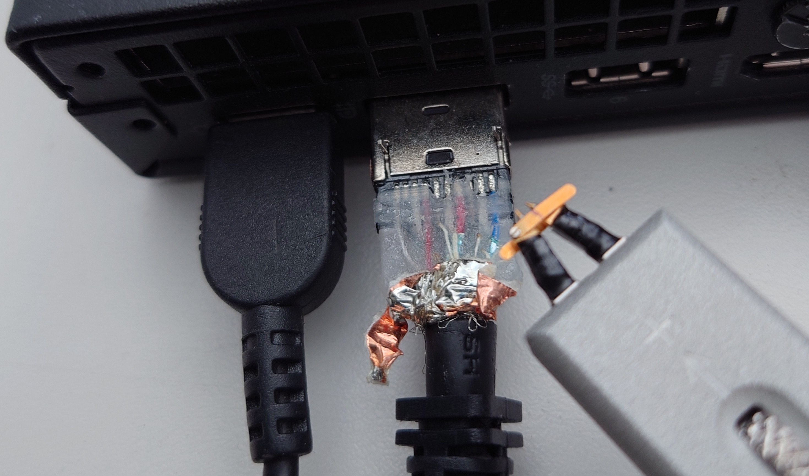

# FCSC 2025 DisplayPort

Avec ma sonde différentielle ultra rapide j’ai réussi a mesurer un signal différentiel entre les pins #1 et #3 du connecteur DisplayPort branché sur mon PC. C’est un signal série binaire à 1,62 Gigabit par seconde. J’ai fait le pré-traitement du signal et j’ai pu reconstruire fidèlement la séquence de bit transmise par la carte vidéo (qui est compatible avec la norme DisplayPort 1.2). J’ai enregistré ces bits dans un fichier binaire, au format suivant : 8 bits par octet, le bit de poids fort étant le premier bit transmis (MSB first).

Je sais qu’au moment où j’ai fait la capture du signal, mon (unique) écran était configuré en 800x600 75Hz 24 bits/pixel RGB 1-lane, et affichait une photographie de mes collègues de bureau tenant le flag dans leurs (petites) mains.

J’ai perdu cette magnifique photo, pourrez-vous la reconstituer à partir de cette capture ?

Voici ci-dessous une photo montrant où a été faite la mesure (à titre purement indicatif, celle-ci n’est pas nécessaire pour résoudre).

Note : il n’est pas nécessaire d’acheter de normes, cherchez sur internet !

Auteur : PMR

Origine : [DisplayPort](https://hackropole.fr/fr/challenges/hardware/fcsc2025-hardware-displayport/)

## Challenge
[files/DisplayPort.bin](files/DisplayPort.bin)

-----------

## Installation manuel
Vous n'utilisez pas l'application **les CTFs de Cyrhades** ? C'est dommage !
Mais voici comment installer ce CTF manuellement :

> git clone https://github.com/Hack-Oeil/fcsc2025-hardware-displayport.git

> cd fcsc2025-hardware-displayport

> docker compose up

-----------

## Sur le site officiel hackropole.fr
> https://hackropole.fr/fr/challenges/hardware/fcsc2025-hardware-displayport/
